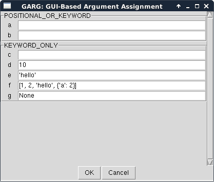

# Garg

GUI-based function argument assignment in Python

Garg is a tool for easily creating GUI windows that allow users to
bind values to the parameters of a callable, such as functions or
user-defined classes implementing the `__call__` method and
`__signature__` property. It is meant to ease GUI development by
creating a common graphical interface that can be implemented anywhere
a user needs to specify values for input parameters to a callable.

Garg is written in Python 3 and exclusively uses tools from the
standard library.

# Installation

```sh

pip install garg

```

# How to use Garg

Suppose we have a function called `test` that has two positional or
keyword parameters and five keyword only parameters: 

```python

from garg import Garg

def test(a,	b, *,
	     c, d=10, e='hello',f=[1, 2, 'hello', {'a': 2}], g=None):
     pass

```

Garg generates a GUI window that allows the user to interactively
assign values for the arguments of `test`:

```python

c = Garg(test)
c.run()

```

If you're doing this in an interactive session, you may have to
combine the object instantiation and `run()` method call on one line:

```python

c = Garg(test); c.run()

```

The above code produces the GUI window below:



As you can see, default values are already present in the associated
text boxes. Blank text boxes indicate that there is no default value
for the associated parameter.

To enter a value for an argument, fill in each text box with a Python
literal. (Note: Garg uses
[ast.literal_eval](https://docs.python.org/3/library/ast.html#ast.literal_eval)
to parse the strings in the text box by default. This limits the use
of Garg to basic Python datatypes but is much more secure than
something like `eval`.)

After entering values for each argument, press **OK**. The values
entered in the GUI are bound to their corresponding parameters and
stored in the `ba` attribute of the `Garg` instance. Assuming we
entered `1`, `2`, and `3` for `a`, `b`, and `c`, respectively and left
the remaining parameters at their default values:

```python

>>> print(c.ba)
<BoundArguments (a=1, b=2, c=3, d=10, e='hello', f=[1, 2, 'hello', {'a': 2}], g=None)>

```

To access these arguments, use the `args` and `kwargs` attributes of
the `BoundArguments` object.

```python

>>> print(c.ba.args)
(1, 2)
>>> print(c.ba.kwargs)
{'d': 10, 'c': 3, 'e': 'hello', 'g': None, 'f': [1, 2, 'hello', {'a': 2}]}

```

## Syntax errors

By default, a value that cannot be read by `ast.literal_eval` will
raise a `SyntaxError`. If you want to ignore these errors, you can
initialize a Garg instance with the `ignore_errors=True`
argument. Only arguments that are successfully bound will appear in
the `BoundArguments` object after the **OK** button is pressed.

```python

c = Garg(test, ignore_errors=True)

```

## Caveats

### Kinds of parameters

For simplicity, Garg only allows assignment to two of the five
possible
[kinds of Python parameters](https://docs.python.org/3/library/inspect.html#inspect.Parameter.kind):
*POSITIONAL_OR_KEYWORD* and *KEYWORD_ONLY*.

Adding support for the other kinds of parameters would involve
implementing a special way to handle *POSITIONAL_ONLY* kinds so that
they are bound to the parameters in the right order. *VAR_POSITIONAL*
and *VAR_KEYWORD* kinds would involve modifying the GUI's View so that
the user may input a string of arguments. These would then need to be
parsed into valid Python datatypes.

### Empty strings

Empty strings, i.e. `''`, cannot currently be bound as argument values
to parameters of the input callable. The reason for this is that Garg
uses
[ast.literal_eval](https://docs.python.org/3/library/ast.html#ast.literal_eval)
to evaluate the strings. Passing an empty string to `ast.literal_eval`
raises a `SyntaxError`.

One way to overcome this limitation is to implement a custom parser
that replaces `ast.literal_eval` and converts the user's inputs to
Python datatypes.

# Getting help

Please do not hesitate to open an
[issue](https://github.com/kmdouglass/garg/issues) if you encounter
bugs or other problems with Garg.

# Authors

1. [Kyle M. Douglass](mailto:kyle.m.douglass@gmail.com)
2. Felix Schaber

# License

Garg is MIT licensed. See [the LICENSE file](LICENSE) for more
information.
